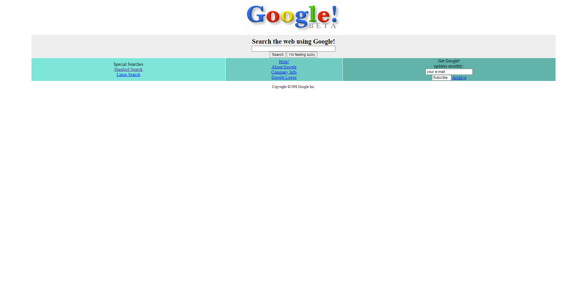

# My Watch

Bu repo [Patika.Dev](https://www.patika.dev) Front-End Eğitiminde ödev olarak yapmış olduğum patikacss3 uygulaması.

 //Resim ekleyebilirsin


## Installation
Öncelikle projeyi clonelayın.[patikahomework3](https://github.com/NoppePay/patikahomework3.git)

```bash
git clone https://github.com/NoppePay/patikacss3.git
```

## Usage

Projeyi cloneladıktan sonra Visual Studio Code programında açınız.

Linux için:

```linux
cd patikacss3
code .
```

## Contributing

Pull requestler kabul edilir.

## License

[MIT](https://choosealicense.com/licenses/mit/)